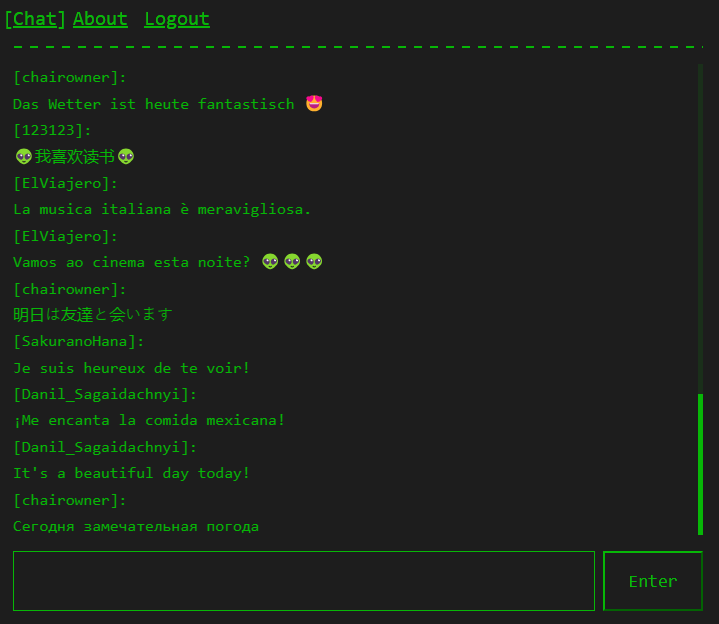
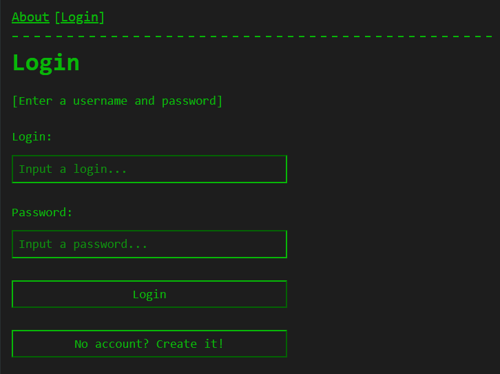
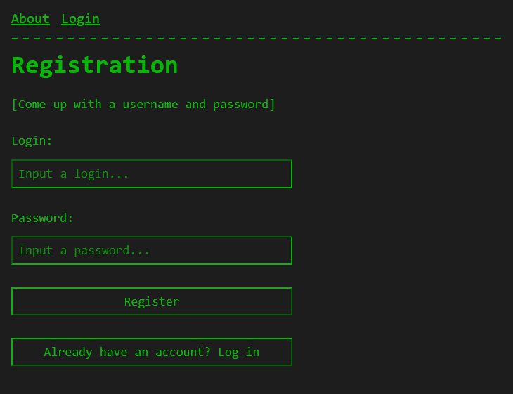

# terminal_chat application

## Introduction / Предисловие

This chat on WebSockets was created by _chairowner_ in 2024 **for study of libraries**.\
If you want to use its basis to implement your idea, do it at your own risk, because this code was written at night after work (•‿•)\
Please inform me that you have taken the code. I will be glad to see your final result.

---

Этот чат на веб-сокетах был создан _chairowner_ в 2024 году **для изучения библиотек**.\
Если вы хотите использовать его основу для реализации своей идеи, делайте это на свой страх и риск, т.к. код писался ночами после работы (•‿•)\
Пожалуйста, сообщите мне, если вы взяли код. Я буду рад увидеть ваш окончательный результат.

## Screenshots / Скриншоты

**Chat page**\

**Login page**\

**Registration page**\

## Startup / Запуск

First, install **docker-compose** / **Docker Desktop**. It will be used to launch the database.\
You can also run it via **Docker Swarm** `./stack.prod.yml`/`./stack.dev.yml` (for dev, you need to build the client part yourself via `npn run build`)

---

Для начала установите **docker-compose** / **Docker Desktop**. С его помощью будет запускаться база данных.\
Также можно запустить через **Docker Swarm** `./stack.prod.yml`/`./stack.dev.yml` (для dev необходимо самостоятельно собирать клиентскую часть через `npn run build`)

- `docker build -t local/terminal_chat_client:latest -f ./docker/client/Dockerfile .`
- `docker build -t local/terminal_chat_server:latest -f ./docker/server/Dockerfile .`
- `docker stack deploy -c ./stack.prod.yml --detach=false terminal_chat`

### Additional / Дополнительно
#### Windows

Register `start dev.bat` from the root directory of the project

---

Прописать `start dev.bat` из корневой директории проекта

#### Linux

1. `docker-compose -f ./compose.database.yml -p terminal_chat up -d --build`
2. `cd ./server && npm i && npm run dev`
3. `cd ./client && npm i && npm run dev`
